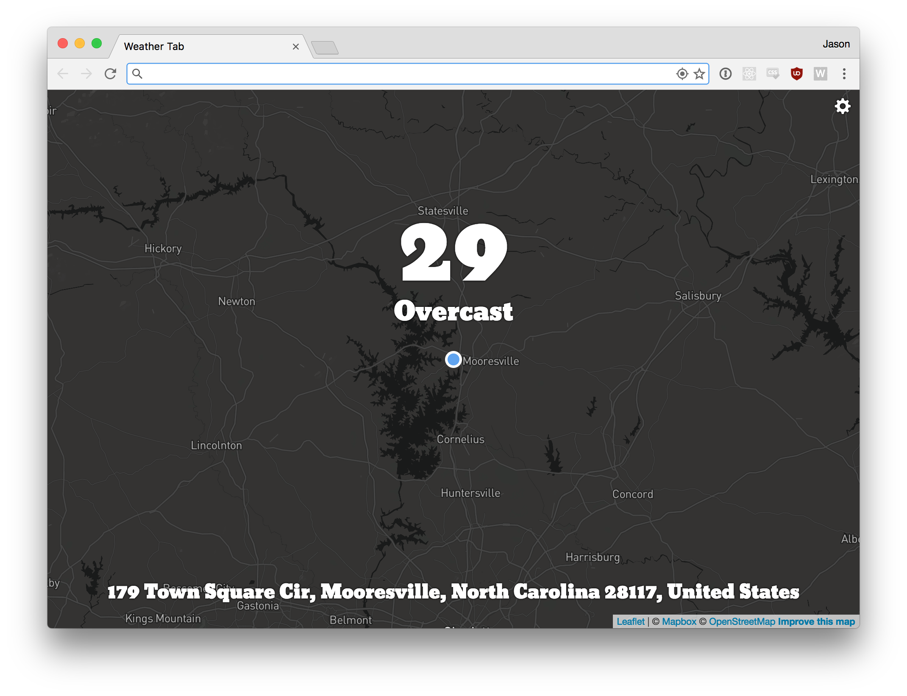
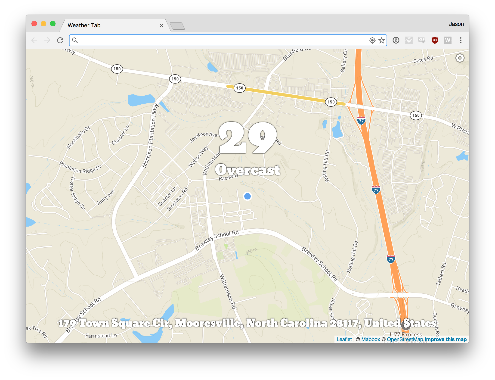
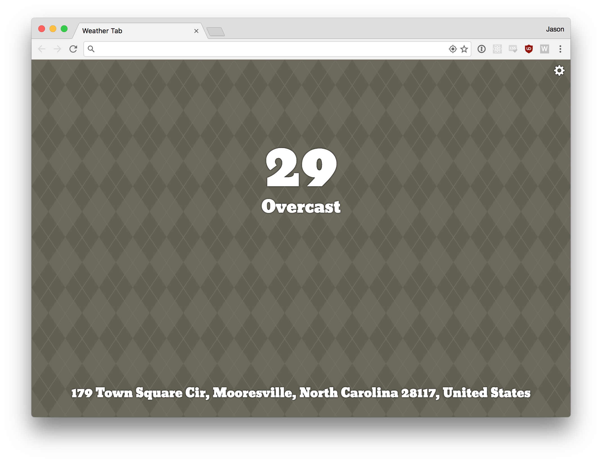
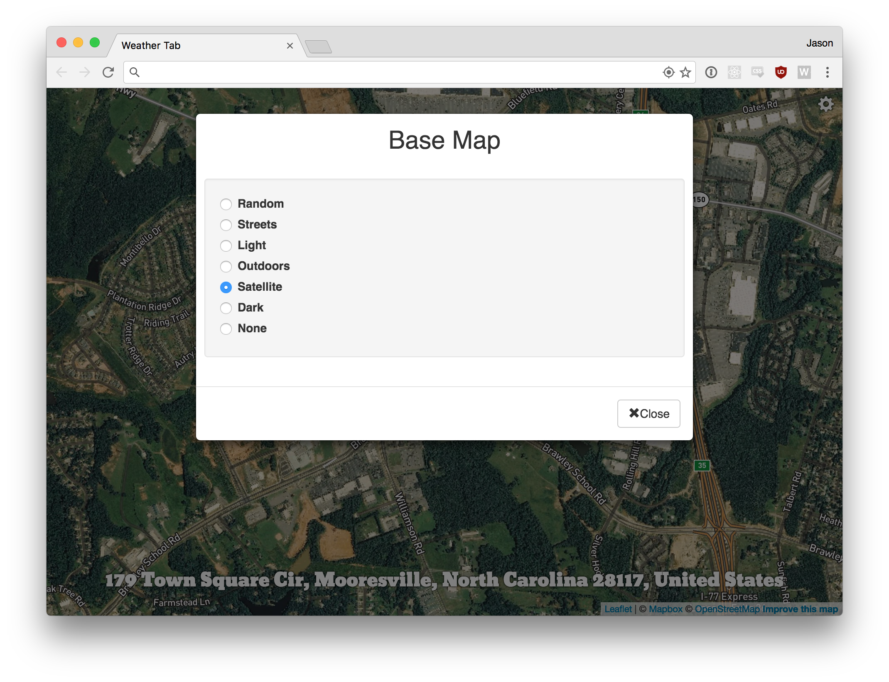

## Weather Tab

This is a Chrome extension to show your current location and weather in new tabs.

I stole most of the ideas here from [MapTab](https://github.com/bsudekum/MapTab), but instead of showing a random location on a pretty map, we show your current location on a pretty map with the current weather.









### Installation

I'm using my personal Mapbox and DarkSky tokens for this project right now, so I don't want to push it to the app store. So to install you'll need to choose the "Load unpacked extension..." option in the Google Chrome extension settings. From there choose the `build` directory of this repo.

### Developing

This project uses [react-scripts](https://www.npmjs.com/package/react-scripts), so you should check there for detailed instructions but it's mostly just:

```
cd /path/to/weather-tab
npm install
npm start
```

You should see a new live updating browser tab with this application.
